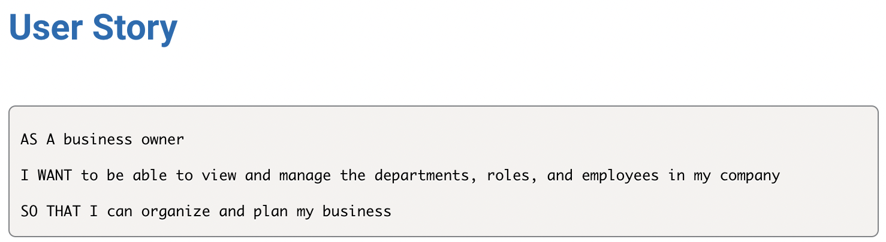
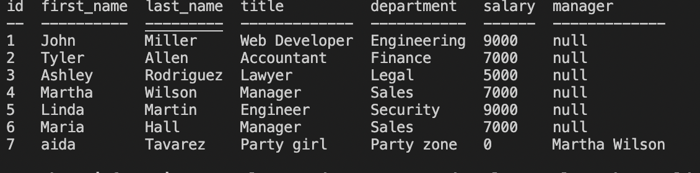

# employee-tracker

## Description

This application called Employee tracker is a command-line application that manages a company's employee database, using Node.js, Inquirer, and MySQL.

## User story

## Usage 
* This application will allow users to: 
    - View all department 
    - view all roles 
    - view all employees 
    - Add a department 
    - Add a role 
    - Add an employee 
    - Update employee role 

## Screenshots

## Demo Video

<a href="https://drive.google.com/file/d/1fsQPIh1VKGxrlEas-OgDZIt8zPV5Fp1D/view">Demonstration Video</a>

## Technologies Use

<a href="https://www.npmjs.com/package/inquirer">Inquirer.js</a>

<a href="https://nodejs.org/">Node.js</a>

<a href="https://dev.mysql.com/downloads/mysql/">Mysql</a>

